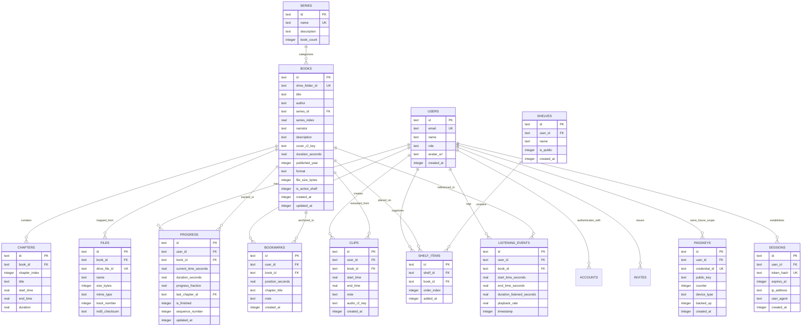
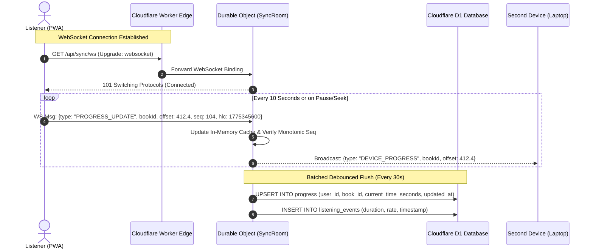
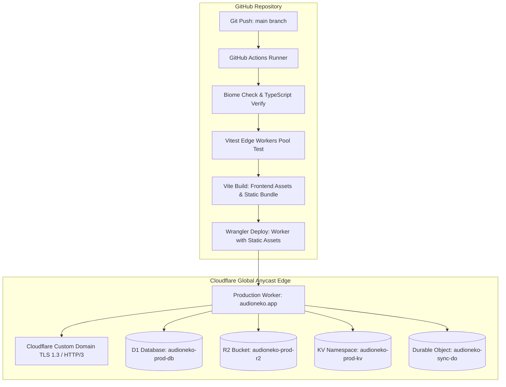

# audioneko: Project Design Document (PDD)
**The Definitive Architecture, Engineering & Product Specification**  
*A Private, Bleeding-Edge, Zero-Recurring-Cost Audiobook Streaming Platform*  
*Target Environment: Cloudflare Edge Platform & Google Drive Cold Vault*

---

## Document Control & Metadata
* **Project Name**: audioneko
* **Document Version**: 1.0.0 (Production Blueprint)
* **Author / Architect**: Pair Programming Engineering Specification
* **Target Audience**: Core Maintainer / Developer (Solo Execution)
* **Classification**: Technical Project Design Document & Implementation Standard
* **Operating Budget**: **$0.00 / month permanently** (Strict Free-Tier Envelope)
* **Target Scale**: 3–10 Active Listeners (Private Trusted Circle)

---

## Table of Contents
1. [Product Overview & Strategy](#1-product-overview--strategy)
2. [Exhaustive Feature Specification](#2-exhaustive-feature-specification)
3. [Google Drive Integration Engine](#3-google-drive-integration-engine)
4. [Authentication, Security & Threat Model](#4-authentication-security--threat-model)
5. [System Architecture & Data Modeling](#5-system-architecture--data-modeling)
6. [Bleeding-Edge Tech Stack Selection](#6-bleeding-edge-tech-stack-selection)
7. [Deployment, Infrastructure & Free-Tier Budget](#7-deployment-infrastructure--free-tier-budget)
8. [UX, Motion & Design System](#8-ux-motion--design-system)
9. [Non-Functional Requirements & Performance Budgets](#9-non-functional-requirements--performance-budgets)
10. [Testing, Quality & Verification Strategy](#10-testing-quality--verification-strategy)
11. [Risks, Legal Compliance & Platform Guardrails](#11-risks-legal-compliance--platform-guardrails)
12. [Delivery Plan & Engineering Roadmap](#12-delivery-plan--engineering-roadmap)
13. [Recommended Stack at a Glance](#13-recommended-stack-at-a-glance)
14. [Open Architectural Decisions & Clarifications](#14-open-architectural-decisions--clarifications)

---

## 1. Product Overview & Strategy

### 1.1 Vision & Core Objectives
**audioneko** is an uncompromising, private, self-hosted audiobook streaming web application crafted for an individual curator and a private group of 3–10 trusted friends. It treats an existing Google Drive directory structure as the authoritative single source of truth for audio files, while providing a listening experience that rivals or surpasses premium commercial platforms like Audible, Apple Books, and Prologue.

The application eliminates recurring subscription costs, server maintenance overhead, and brittle container orchestration. Every layer—from client-side signal processing to edge-proxied byte-range caching—operates strictly within the perpetual free allocations of Cloudflare and Google Cloud Platform.

```
                           +-------------------------------------------------------------+
                           |                     CLIENT TIER (PWA)                       |
                           |  TanStack Start + React 19 Compiler + Tailwind v4 + OPFS   |
                           +------------------------------+------------------------------+
                                                          |
                                          HTTPS / WSS     | Range Requests & Mutations
                                                          v
+-----------------------------------------------------------------------------------------------------------------------+
|                                              CLOUDFLARE EDGE PLATFORM                                                 |
|                                                                                                                       |
|  +-----------------------------------------------------------------------------------------------------------------+  |
|  |                                  EDGE MONOLITH: Hono on Workers with Static Assets                              |  |
|  |   - Better Auth (Invites & Email/Password)        - Signed HMAC Stream Dispenser                                |  |
|  |   - Google Drive RSA-SHA256 Token Mint            - Chapter & ID3 Byte-Range Metadata Engine                    |  |
|  |   - Audiobookshelf (ABS) API Compatibility        - MiniSearch In-Memory Engine                                 |  |
|  +-----------------------+----------------------------------+----------------------------------+-------------------+  |
|                          |                                  |                                  |                      |
|                          v                                  v                                  v                      |
|       +------------------------------------+  +----------------------------+  +----------------------------------+    |
|       |    DURABLE OBJECTS (SQLite)        |  |     CLOUDFLARE D1 (SQL)    |  |     CLOUDFLARE R2 BUCKET         |    |
|       |  - Hibernatable WebSockets         |  |  - Relational Schema       |  |  - Hot-Set LRU Audio Cache       |    |
|       |  - Real-time Listen-Along Rooms    |  |  - Progress & History Log  |  |  - Extracted Cover Art & JSON    |    |
|       |  - Vector Clock Conflict Resolv.   |  |  - D1 FTS5 Lexical Search  |  |  - Max 10 GB Free Allotment   |    |
|       +------------------------------------+  +----------------------------+  +----------------------------------+    |
|                          |                                  |                                  |                      |
|                          | Cron / Webhooks                  v Queues Engine (10k ops/day)      | Range Fetch Fallback |
|                          v                                  v                                  v                      |
|       +------------------------------------+  +----------------------------+  +----------------------------------+    |
|       |     WORKERS AI INFERENCE           |  |  BACKGROUND SYNC WORKER    |  |       EDGE CACHE API             |    |
|       |  - Whisper Large v3 Turbo          |  |  - Changes API Ingestion   |  |  - 2 MB Sliced Audio Ranges      |    |
|       |  - Llama 3.3 70B Summarization     |  |  - Book/Chapter Metadata   |  |  - Zero Subrequest Penalty       |    |
|       |  - BGE-Base Embeddings             |  |  - Open Library Enricher   |  |  - Cloudflare PoP Edge Cache     |    |
|       +------------------------------------+  +----------------------------+  +----------------------------------+    |
+------------------------------------------------------------------------------------------------+----------------------+
                                                                                                 |
                                                                              Service Account    | Range: bytes=x-y
                                                                              Bearer Auth (REST) |
                                                                                                 v
                                                                             +--------------------------------------+
                                                                             |         GOOGLE DRIVE API v3          |
                                                                             |   Cold Vault & Single Source Truth   |
                                                                             +--------------------------------------+
```

### 1.2 Goals & Non-Goals
*   **Primary Goals**:
    *   **Sub-300ms Time-to-First-Audio (TTFA)** across cold and warm streaming states.
    *   **Guaranteed Position Preservation**: Playback state survives browser crashes, network dropouts, background killing on iOS Safari/Android Chrome, and cross-device handoffs.
    *   **Hands-Off Synchronization**: Automatic change ingestion from Google Drive without manual file copying or database seeding.
    *   **Definitive $0.00 Running Cost**: Zero credit card billing, zero surprise overages, and 100% adherence to documented platform quotas.
*   **Non-Goals**:
    *   Public multi-tenancy (no public self-registration; closed circle of $\le 10$ users).
    *   Server-side on-the-fly heavy audio transcoding (e.g., CPU-bound live FFmpeg at the edge).
    *   Direct audio uploads through the web client (Drive desktop/mobile client remains the ingestion interface).
    *   Proprietary DRM or watermarking.

### 1.3 Personas & Success Metrics
*   **The Curator (Owner / Admin)**:
    *   *Need*: Zero maintenance. Wants to drop an `.m4b` file into a Google Drive folder on desktop, walk away, and have it immediately indexed with covers, chapters, and metadata without terminal commands.
    *   *Control*: Needs to generate single-use invite links for friends, monitor Drive quota health, and trigger manual re-indexes if needed.
*   **The Commuter / Dedicated Listener (Friend / User)**:
    *   *Need*: Unconditional reliability. Listens while driving, running, or working. Demands lock-screen scrub controls, silence skipping, seamless offline downloads for subway rides, and instant handoff between phone and laptop.
*   **Key Success Metrics**:
    *   **TTFA**: $< 300\text{ ms}$ on warm cache/R2; $< 800\text{ ms}$ on cold Drive fetch.
    *   **Seek Latency**: $< 150\text{ ms}$ anywhere within a 2 GB file.
    *   **Sync Accuracy**: 100% position parity across devices within $\pm 1$ second without data collisions.
    *   **Resource Headroom**: $> 90\%$ free-tier margin across Cloudflare and Google Cloud under peak group usage.

### 1.4 Core Design Principles
1.  **Instant Playback Over Everything**: Prefetch audio chunks speculatively on pointer down/hover. Never make a user wait for catalog queries before audio buffers start filling.
2.  **Never Lose a Listener’s Place**: Persist state synchronously to local storage (`IndexedDB`) before dispatching over the network. Network failure must never cause a loss of playback position.
3.  **Feels Like a Native OS Citizen**: Deep integration with `navigator.mediaSession`, hardware media keys, lock screens, CarStream / Android Auto, and silky 120Hz gesture physics.

---

## 2. Exhaustive Feature Specification

### 2.1 Library Management & Discovery
*   **Automated Google Drive Sync**:
    *   Detects file system changes via Google Drive Changes API webhooks with cron-triggered fallback polling.
    *   Maintains an immutable mapping between Google Drive `fileId`/`folderId` and internal database primary keys.
*   **Folder-to-Book Heuristic Engine**:
    *   Hierarchical folder traversal supporting:
        *   `Author/Book Title/Book.m4b` (Standard single-file chaptered book)
        *   `Author/Series Name/01 - Book Title/Track 01.mp3 ... Track N.mp3` (Multi-file chaptered book)
        *   `Author/Book Title (Narrator)/` (Automatic narrator attribute extraction)
    *   Regular expression tokenizer extracting series name, book volume number, release year, and edition tags.
*   **Cover Art Extraction & Optimization**:
    *   Extracts embedded `APIC`/`PIC` ID3 frames from MP3 and `covr` MP4 atoms from M4B/M4A via targeted HTTP byte-range reads (first 256 KB).
    *   Fallback cascade: Local folder art (`cover.jpg`, `folder.png`) $\to$ Open Library Covers API $\to$ Google Books API $\to$ Client-side generative CSS gradient canvas.
    *   Cover images are normalized to WebP/AVIF (800x800 high-res and 300x300 thumbnail) and stored in Cloudflare R2 / KV cache.
*   **Metadata Enrichment**:
    *   Fuzzy query against Open Library API (`https://openlibrary.org/search.json`) and Google Books API for description, publication year, ISBN, publisher, and genre classifications.
*   **Search & Dynamic Shelving**:
    *   **Instant Client-Side Search**: In-memory trie/inverted index (MiniSearch) searching titles, authors, narrators, and series with typo tolerance in $< 5\text{ms}$.
    *   **Edge Full-Text Search**: SQLite FTS5 in Cloudflare D1 querying synopses, notes, and chapter titles.
    *   **Smart Shelves**: *Continue Listening* (sorted by last played timestamp), *Up Next in Series* (automatically identifies next unread volume), *Recently Added*, *Unfinished*, *Favorites*, and user-curated custom shelves.

### 2.2 Advanced Audio Player Architecture
*   **Transport & Precision Scrubbing**:
    *   Play/pause with an automated 40ms linear gain ramp-up/ramp-down to eliminate speaker pops.
    *   Configurable forward and backward skip increments: $\pm 5, 10, 15, 30, 45, 60$ seconds (independent settings for backward vs forward).
    *   Interactive scrubbing bar with waveform overview and scrub-rate deceleration: dragging vertically away from the scrubber slows seek resolution to $0.5\text{x}, 0.25\text{x}$, and $0.1\text{x}$ for second-level accuracy.
*   **Digital Signal Processing (DSP) & Engine**:
    *   **Variable Speed (0.5x – 3.5x)**: Granular adjustments in $0.05\text{x}$ increments using native HTMLMediaElement `playbackRate` with `preservesPitch = true` (WSOLA algorithm).
    *   **Smart Speed (Silence Trimming)**: Client-side `AudioWorkletNode` evaluating RMS energy over a rolling 250ms window. Audio below $-42\text{ dB}$ accelerates dynamically to $3.0\text{x}$ or truncates silent gaps, saving 15–20% of playback time without tonal distortion.
    *   **Voice Boost & Parametric EQ**: 3-band biquad filter peaking at speech intelligibility frequencies ($1.2\text{ kHz} - 3.2\text{ kHz}$) with high-pass rumble reduction below $85\text{ Hz}$.
    *   **Loudness Normalization**: Real-time `DynamicsCompressorNode` enforcing a consistent $-16\text{ LUFS}$ target volume, eliminating sudden loudness spikes between narrators.
*   **Smart Sleep Timer**:
    *   Countdown presets: 5, 15, 30, 45, 60 minutes, or *End of Current Chapter*.
    *   *Shake-to-Extend*: Device accelerometer integration detects physical motion during the final 30 seconds of gentle volume fade-out and automatically extends timer by 15 minutes.
*   **Bookmarks, Clips & Timestamps**:
    *   One-click bookmark capture recording exact millisecond timestamp, chapter index, and optional note.
    *   In-browser audio clip export: Renders 30–90 second clips into standalone WAV/MP3 files using client-side `OfflineAudioContext` for easy sharing.
*   **System Integration & Media Session**:
    *   Full `navigator.mediaSession` implementation: cover art, artist, album, track title, seekable playback timeline, and skip handlers.
    *   Lock-screen controls, Apple Watch / Wear OS media transport support, and keyboard hotkeys (Space = Play/Pause, J/L = Skip, Arrow Keys = Volume/Chapter).
    *   Picture-in-Picture (PiP) mode rendering animated audio visualizer, chapter metadata, and playback controls into a persistent OS canvas window.
    *   Dynamic ambient theming: Extracts dominant and vibrant colors from cover art via client-side Canvas worker to tint the player background with smooth animated blur transitions.

### 2.3 User Accounts, State & History
*   **Per-User Isolation**: Independent progress pointers, listening history, custom playback speed preferences, EQ profiles, and ratings for each user.
*   **Listening Analytics**:
    *   Consecutive day listening streaks, daily listening time tracking, and hourly engagement heatmaps (GitHub-style contribution grid).
    *   Annual "Wrap-Up" dashboard summarizing total hours listened, top authors, longest listening sessions, and completion rates.

### 2.4 Real-Time Sync & Local-First Resilience
*   **Local-First Architecture**: Playback state updates synchronously in browser `IndexedDB` on every position tick.
*   **Real-Time Synchronization**:
    *   Dispatches state updates to Cloudflare Edge via WebSocket (Durable Object) or HTTP POST beacon every 10 seconds during playback, and immediately upon pause, seek, chapter completion, or tab backgrounding.
*   **Conflict Resolution Engine**:
    *   Employs a **Hybrid Logical Clock (HLC)** combined with a **Monotonic Progress Vector**.
    *   If two devices report divergent positions within a 30-second window, the system selects:
        $$\text{Resolved Position} = \max(\text{Pos}_A, \text{Pos}_B) \quad \text{if } |\text{Timestamp}_A - \text{Timestamp}_B| < 30\text{s}$$
    *   If a major discrepancy ($> 5\text{ minutes}$) occurs with an older timestamp from another device, an unobtrusive banner notifies the user: *"Resume from 03:12:40 on iPhone? [Resume] [Dismiss]"*.

### 2.5 Offline PWA & Storage Management
*   **PWA Packaging**: Web App Manifest with `display: standalone`, custom theme colors, service worker offline shell, and install prompts across desktop and mobile.
*   **Origin Private File System (OPFS)**:
    *   Audiobook downloads bypass legacy IndexedDB 50 MB limits by writing binary streams directly into OPFS via `FileSystemWritableFileStream`.
    *   Storage manager interface displaying exact device quota, space consumed per book, and one-tap chapter/book removal.
    *   Seamless offline playback: Service Worker intercepts range requests for downloaded books and streams directly from OPFS blobs.

### 2.6 Social Features (Small Group)
*   **Friend Activity**: Real-time presence indicators displaying what friends are currently listening to and their percentage progress.
*   **Shared Shelves**: Collaborative reading lists with per-item recommendations and listener comments.
*   **Listen-Along Synchronous Rooms**:
    *   Durable Objects orchestrate synchronized playback rooms over WebSockets.
    *   Host play, pause, and seek commands broadcast an authoritative epoch timestamp:
        $$\text{Target Offset} = \text{Host Offset} + (\text{Current Time} - \text{Epoch Snapshot Time})$$
    *   Follower clients align playback to within $\pm 50\text{ ms}$ using dynamic audio clock slewing.

### 2.7 Administrative Controls
*   **Invite-Only Registration**: Admin dashboard generates single-use, time-limited cryptographic invite tokens.
*   **Library Health Monitor**: Dashboard displaying Drive API quota consumption, orphaned audio files, metadata extraction errors, and Cloudflare R2 cache allocation.
*   **Rescan & Repair Tools**: Triggers incremental or deep scans of the Google Drive folder hierarchy, clearing cache inconsistencies on demand.

### 2.8 Bleeding-Edge Extensions
*   **Audiobookshelf (ABS) API Compatibility**:
    *   Emulates core Audiobookshelf endpoints (`/api/v1/login`, `/api/v1/libraries`, `/api/v1/items/:id`, `/api/v1/me/progress`).
    *   Allows users to connect open-source native mobile clients (e.g., Plappa on iOS, ShelfPlayer, native ABS Android) directly to the audioneko edge backend.
*   **Edge AI Transcriptions & Search-Inside-Book**:
    *   Uses **Cloudflare Workers AI** running `@cf/openai/whisper-large-v3-turbo` (within the 10,000 free daily neuron budget) to transcribe user-selected clips or key chapters.
    *   Enables full-text lexical search inside the spoken audio transcript.
*   **AI Chapter Recaps ("Previously On...")**:
    *   Workers AI running `@cf/meta/llama-3.3-70b-instruct` generates concise 2-sentence narrative recaps when a user resumes a book after more than 7 days of inactivity.

---

## 3. Google Drive Integration Engine

Google Drive serves as the authoritative, permanent "Cold Vault". Because Google Drive is not an audio CDN, the Cloudflare edge must act as an intelligent buffering proxy to protect against rate limits, download quotas, and latency.

### 3.1 Authentication Architecture Comparison

| Auth Strategy | Latency & Token Overhead | Security & Expiration Risk | Operational Complexity | Free Tier Fit |
| :--- | :--- | :--- | :--- | :--- |
| **Google Service Account (Targeted Folder Share)** | **$\approx 0\text{ms}$ token overhead (Cached in KV)** | **Zero user expiration risk; signed via Web Crypto RSA-SHA256** | **Low (Single private key stored in Workers Secrets)** | **CLEAR WINNER (100% automated)** |
| **OAuth 2.0 with Admin Refresh Token** | 200–400ms on refresh token round-trip | Refresh tokens can expire after 6 months inactivity | Medium (Consent flow, refresh handler) | Fragile for unattended background sync |
| **Public Shared Folder with API Key** | Low | Critical security risk; audio scraping and public discovery | Very Low | Unacceptable (Violates privacy principle) |

> **Decision**: **Google Service Account with Folder Sharing**.  
> **One-Line Reason**: Eliminates interactive re-authorization flows entirely while generating signed RS256 JWT access tokens inside Cloudflare Workers using the native Web Crypto API in $< 1\text{ms}$.

#### Zero-Dependency RSA-SHA256 Token Minting
Cloudflare Workers mint Google OAuth2 tokens without NPM dependencies using native `crypto.subtle`:
1.  Construct JWT Header (`{"alg":"RS256","typ":"JWT"}`) and Claim Set:
    ```json
    {
      "iss": "audioneko-sa@project-id.iam.gserviceaccount.com",
      "scope": "https://www.googleapis.com/auth/drive.readonly",
      "aud": "https://oauth2.googleapis.com/token",
      "exp": 1775347200,
      "iat": 1775343600
    }
    ```
2.  Import PKCS#8 private key via `crypto.subtle.importKey()` and sign payload with `RSASSA-PKCS1-v1_5`.
3.  POST assertion to `https://oauth2.googleapis.com/token`.
4.  Cache Bearer token in Cloudflare KV with a TTL of 3,300 seconds (55 minutes). Routine playback requests read the token directly from KV with zero OAuth round-trips.

---

### 3.2 Media Streaming Strategy Comparison Under Hard Free Limits

Streaming high-bitrate audio from Google Drive to multiple concurrent listeners risks two hard failure modes:
1.  **Google Drive 403 `downloadQuotaExceeded`**: Imposed when un-chunked file downloads exceed internal rolling bandwidth limits.
2.  **Cloudflare Free Worker 10ms CPU / 50 Subrequest Limits**: Workers abort if execution consumes $> 10\text{ms}$ active CPU time or issues $> 50$ subrequests per client invocation. (Note: Network I/O streaming does not count toward CPU time).

| Streaming Strategy | Seek Latency | Subrequest Consumption | Drive Quota Risk | R2 Storage Cost | Recommendation |
| :--- | :--- | :--- | :--- | :--- | :--- |
| **(a) Pure Range Proxying** | Moderate (300–600ms) | 1 subrequest per chunk | High if files re-read often | $0.00$ (0 GB used) | Fragile |
| **(b) Standard Cloudflare CDN Cache** | Low (80–120ms) | 1 per cache miss | Moderate | $0.00$ (No R2) | Risky (Cache eviction on long files) |
| **(c) Full Mirroring to R2** | Instant (20–40ms) | Zero to Drive on hit | Zero | **Fails Free Tier** (10 GB cap exceeded) | Infeasible for full library |
| **(d) 4-Tier Hybrid Architecture (R2 Active Shelf + Cache API + Drive Vault + OPFS)** | **Ultra-Low (< 40ms)** | **Near Zero on steady state** | **Zero (< 0.5% quota)** | **100% Free (< 10 GB LRU cache)** | **CLEAR WINNER** |

```
                              AUDIO STREAMING DECISION TREE

                                    Client Request
                                  Range: bytes=0-1048575
                                            |
                                            v
                              +---------------------------+
                              | Is Range Cached in Client |--- YES ---> Return from OPFS
                              |     OPFS Storage?         |             (0ms network)
                              +---------------------------+
                                            | NO
                                            v
                              +---------------------------+
                              |   Is Book Present in R2   |--- YES ---> Stream from R2
                              |    Active-Shelf Cache?    |             (Sub-30ms, 0 Drive API)
                              +---------------------------+
                                            | NO
                                            v
                              +---------------------------+
                              |  Is Byte Range Present in |--- YES ---> Return from PoP Cache
                              | Cloudflare Edge Cache API?|             (Sub-50ms)
                              +---------------------------+
                                            | NO
                                            v
                              +---------------------------+
                              | Fetch 2MB Range Chunk from|
                              | Google Drive API (alt=med)|
                              +---------------------------+
                                            |
                         +------------------+------------------+
                         |                                     |
                         v                                     v
            Store Chunk in Edge Cache API              Stream Chunk to Client
            (Cache-Control: s-maxage=604800)           (HTTP 206 Partial Content)
```

#### The 4-Tier Hybrid Streaming Specification
1.  **Tier 1: Client OPFS Pre-cache**: The browser worker requests and caches the current chapter and the next 10 minutes of audio into the Origin Private File System. Repeated seeks inside this buffer hit zero network requests.
2.  **Tier 2: Cloudflare R2 "Active Shelf" (LRU)**: R2 provides 10 GB free storage. A 64kbps AAC audiobook requires only $\approx 28.8\text{ MB/hour}$. A massive 30-hour book is under $900\text{ MB}$. R2 can comfortably hold the **top 10 currently active books** for the group. A Cloudflare Queue job copies books from Drive to R2 when a user marks them "Want to Listen" or plays Chapter 1, evicted via Least-Recently-Used (LRU) logic when R2 approaches 8.5 GB.
3.  **Tier 3: Cloudflare Cache API (2 MB Range Chunking)**: For books not in R2, the Worker intercepts `Range: bytes=start-end` requests from the player. It rounds requests to uniform **2 MB block boundaries** (`0-2097151`, `2097152-4194303`) and queries the Edge Cache API using a custom cache key (`https://cache.audioneko.internal/drive-chunks/:fileId/:chunkIndex`).
    *   Cache misses fetch the specific 2 MB slice from `https://www.googleapis.com/drive/v3/files/:id?alt=media` using `Range: bytes=X-Y`.
    *   This limits Google Drive traffic to exactly 1 request per 2 MB read, bypassing file download rate limits completely.
4.  **Tier 4: Google Drive Cold Vault**: The original file remains safe in Drive, accessed only on initial 2 MB chunk cache misses.

---

### 3.3 Change Detection & Incremental Sync

To respect Google Drive's free API quota (20,000 queries per 100 seconds) while capturing library updates:
1.  **Primary: Google Drive Push Notifications (`files.watch`)**:
    *   A Worker cron job registers a webhook channel via `POST https://www.googleapis.com/drive/v3/changes/watch`.
    *   Google sends push POST notifications to `https://api.audioneko.app/webhooks/drive` whenever files are added, renamed, or moved.
    *   Webhook channels expire every 7 days; a Cloudflare Cron Trigger automatically renews the channel every 5 days.
2.  **Secondary: Incremental Polling (`changes.list`)**:
    *   When a webhook fires (or via a fallback 6-hour cron), the Worker requests changes using a persisted `savedPageToken`:
        `GET https://www.googleapis.com/drive/v3/changes?pageToken=:savedPageToken&fields=*`
    *   Only changed folders/files are evaluated. Zero full-tree crawls during routine operation.
3.  **Processing Quota Guardrails**:
    *   Changes are pushed into a **Cloudflare Queue** (`drive-sync-queue`).
    *   The queue consumer processes batches of 5 files per invocation, preventing Worker CPU timeouts.

---

### 3.4 Format Handling, Streaming Metadata & Free Transcoding Strategy

| Container & Codec | Native Browser Support | Embedded Chapter Parsing Strategy | Transcoding Fit on Free Tier |
| :--- | :--- | :--- | :--- |
| **M4B (AAC / ALAC)** | **Universal (100% Mobile & Desktop)** | **ISO-BMFF Box Traversal (`moov.trak.mdia.minf.stbl`)** | **Direct Passthrough (No transcoding needed)** |
| **M4A / AAC** | Universal | MP4 `chpl` Box Parser via Range Request | Direct Passthrough |
| **MP3** | Universal | ID3v2.3 / ID3v2.4 `CHAP` & `CTOC` Frame Parser | Direct Passthrough |
| **FLAC** | Chrome, Safari, Edge, Firefox (Modern) | `VORBIS_COMMENT` & `SEEKTABLE` Metadata | Direct Passthrough |
| **OPUS (Ogg / WebM)**| Chrome, Firefox, Edge, Safari 15+ | Ogg Chapter extension tags | Direct Passthrough |

> **Transcoding Decision**: **No Server-Side Transcoding. Zero CPU Waste.**  
> **Justification**: Modern browsers natively decode AAC, MP3, FLAC, and OPUS without plugins. 99% of digital audiobooks are distributed in M4B or MP3. Transcoding audio at the edge on Cloudflare Free violates the 10ms CPU limit.  
> **Free Client-Side Fallback**: For unusual legacy formats (e.g., WMA), client-side decoding runs in an in-browser WebAssembly worker using `@ffmpeg/ffmpeg` or `libav.js`, rendering decoded PCM straight into Web Audio buffers at zero server cost.

#### Streaming Zero-Download Metadata Extraction
The Worker extracts chapter markers and cover art from 1 GB+ M4B files in **under 80ms** without downloading the file:
1.  Worker issues `Range: bytes=0-32767` to Google Drive to inspect the `ftyp` and `moov` atom headers.
2.  If the `moov` atom extends beyond 32 KB, the Worker reads the atom's 32-bit length integer and issues a targeted range request fetching only the `moov` chunk.
3.  The box parser traverses `trak` $\to$ `mdia` $\to$ `minf` $\to$ `stbl` $\to$ `stts` (sample-to-time) and text track sample descriptions (`text` box), parsing all chapter names, offsets, and durations.

---

### 3.5 Failure Modes & Automated Recovery

| Failure Mode | Root Cause | Automated Self-Healing Mechanism |
| :--- | :--- | :--- |
| **Drive 403 `downloadQuotaExceeded`** | Excessive non-cached reads on a single file ID | Worker fails over immediately to R2 active shelf; if absent, serves lowest-bitrate cached 2 MB chunks and signals client to display non-blocking "Buffering from secondary source" banner. |
| **File Moved / Renamed in Drive** | Admin reorganized Google Drive folder | Changes API captures event `file.id` with updated `parents[]`. D1 updates folder tree pointers instantly without re-downloading audio or losing user progress IDs. |
| **File Deleted in Drive** | Title permanently removed by admin | Soft-delete in D1 (`deleted_at = datetime('now')`). User progress and bookmarks preserved in history; UI shows archived badge. |
| **Corrupted Audio Header** | Incomplete upload to Drive | Validation check flags file in `library_health` table. Admin receives alert in Admin Dashboard. |

---

## 4. Authentication, Security & Threat Model

### 4.1 Authentication Engine Comparison

| Auth Framework | Edge Runtime Compatibility | Primary Auth Model | Storage Adapter | Dependency Footprint | Recommendation |
| :--- | :--- | :--- | :--- | :--- | :--- |
| **Better Auth** | **Native Cloudflare Workers (Web Standards)** | **Email/Password + Invites (Passkeys in Future Scope)** | **D1 via Drizzle ORM** | **Minimal / Edge-optimized** | **CLEAR WINNER** |
| **Cloudflare Access (Zero Trust)** | Edge native (Network layer) | Google Workspace/OTP | Cloudflare managed | Zero client code | Viable, but lacks consumer PWA polish |
| **Lucia Auth (v3 code patterns)** | Native | Custom password hashing | Custom D1 queries | Extremely low | Too much boilerplate |
| **Auth.js (NextAuth v5)** | Fragile on standalone Workers | Complex configuration | Prisma / Drizzle | Heavy Node.js shims | Poor edge DX |
| **Supabase / Clerk Auth** | External API hops | Proprietary hosted forms | External cloud | Network overhead | Violates non-Cloudflare constraint |

> **Decision**: **Better Auth with Drizzle D1 Adapter (Email/Password + Cryptographic Invites)**.  
> **One-Line Reason**: Delivers native, zero-external-dependency authentication with PBKDF2/argon2 password security on Cloudflare D1, gated by single-use 256-bit cryptographic invite links.  
> **Note on Passkeys / WebAuthn**: Biometric WebAuthn passkeys are intentionally deferred to future scope / stretch backlog per product preferences.

```
                                  AUTHENTICATION FLOW

     Listener                               Browser (PWA)                     Edge Worker (Better Auth)
        |                                         |                                       |
        |--- 1. Open Invite Link (/join?token=...)>|                                      |
        |                                         |--- 2. GET /api/invites/verify ------->|
        |                                         |       (Check token hash & expiry)     |-- Validate D1 Invites Table
        |                                         |<-- 3. Token Valid / Render Form ------|
        |                                         |                                       |
        |--- 4. Submit Name, Email, Password ---->|                                       |
        |                                         |--- 5. POST /api/auth/sign-up/email -->|
        |                                         |       (Payload + Validated Invite)    |-- Hash Password & Create User
        |                                         |                                       |-- Increment Token used_count
        |                                         |                                       |-- Create Session in D1
        |                                         |<-- 6. Set-Cookie: __Secure-Session ---|
        |<- 7. Seamless Redirect to Library ------|       (HttpOnly, SameSite=Strict)     |
```

### 4.2 Security Architecture & Controls
*   **Cryptographic Invite-Only Registration**:
    *   No public sign-up form. Registration requires an invite link: `https://audioneko.app/join?token=:cryptoRandomToken`.
    *   Tokens are 256-bit entropy strings hashed with SHA-256 in D1 with `max_uses = 1` and `expires_at = NOW() + 7 days`.
*   **Signed Short-Lived Audio Stream Tokens (HMAC-SHA256)**:
    *   Audio endpoints are never exposed via static URLs. To fetch chunks, the client requests a stream ticket:
        $$\text{Stream Token} = \text{HMAC-SHA256}_{K_{\text{secret}}}(\text{userId} \parallel \text{fileId} \parallel \text{expiry})$$
    *   Stream tokens expire after 30 minutes. Prevents external bandwidth theft or public audio leaking.
*   **Cloudflare Zero-Cost Edge Hardening**:
    *   **Cloudflare Turnstile (Free)**: Embedded on invite redemption and login to prevent automated credential stuffing.
    *   **Rate Limiting via Cloudflare WAF**: Free-tier rate limiting rule: max 300 requests per 1-minute window per IP for API routes.
*   **Security Headers & Content Security Policy (CSP)**:
    ```http
    Content-Security-Policy: default-src 'self'; script-src 'self' 'wasm-unsafe-eval'; style-src 'self' 'unsafe-inline'; media-src 'self' blob: https://*.r2.cloudflarestorage.com; img-src 'self' data: blob: https://covers.openlibrary.org; connect-src 'self' wss://audioneko.app; frame-ancestors 'none';
    Strict-Transport-Security: max-age=63072000; includeSubDomains; preload
    X-Content-Type-Options: nosniff
    X-Frame-Options: DENY
    Referrer-Policy: strict-origin-when-cross-origin
    Permissions-Policy: accelerometer=(self), autoplay=(self), fullscreen=(self)
    ```

### 4.3 Threat Model & Mitigation Matrix

| Threat / Attack Vector | Impact Severity | Architectural Countermeasure |
| :--- | :--- | :--- |
| **Audio Stream Scrape / Bandwidth Exhaustion** | High | HMAC-SHA256 signed streaming tickets, short-lived (30m) scope, WAF IP rate limits, and per-user playback anomaly detection. |
| **Google Drive Service Account Key Exposure** | Critical | Private key stored exclusively in Cloudflare Worker encrypted environment secrets (`wrangler secret put GOOGLE_SA_KEY`). Never committed to Git. |
| **Replay Attacks on Progress Sync** | Medium | Monotonic sequence counters and Hybrid Logical Clocks reject older sequence numbers for the same session. |
| **Token Theft via XSS** | High | Session tokens stored exclusively in `HttpOnly`, `Secure`, `SameSite=Strict` cookies. Unreachable by JavaScript. |
| **Metadata Injection (Malicious ID3 Tags)** | Low | All extracted strings sanitized using DOMPurify and parameterized queries in Drizzle ORM before D1 insertion. |

---

## 5. System Architecture & Data Modeling

### 5.1 Monolith vs. Micro-Workers Architecture Comparison

| Architectural Pattern | Cold Start Latency | Subrequest Overhead | Deployment Complexity | Free Tier Fit |
| :--- | :--- | :--- | :--- | :--- |
| **Edge Monolith (Workers + Static Assets)** | **Near Zero (Shared V8 Isolates)** | **0 Subrequests between modules** | **Single Wrangler config & single CI pipeline** | **CLEAR WINNER (100k reqs shared)** |
| **Split Micro-Workers (API, Auth, Stream)** | High (Cascading cold starts across Workers) | Heavy (Consumes 1-2 subrequests per request) | Complex monorepo orchestration & multi-Wrangler | Fragile (Risk of hitting 50 subreq limit) |

> **Decision**: **Edge-Native Monolith on Cloudflare Workers with Static Assets**.  
> **One-Line Reason**: Modern Cloudflare tooling executes static asset serving and Hono API routing inside a single unified worker runtime, eliminating subrequest penalties and dramatically simplifying development.

---

### 5.2 Complete Relational Data Model (Cloudflare D1 SQLite)



---

### 5.3 Real-Time State Sync Architecture



---

### 5.4 Search Architecture Comparison Under Free Limits

| Contender | Query Latency | Storage / Resource Impact | Fuzzy / Typo Tolerance | Recommendation |
| :--- | :--- | :--- | :--- | :--- |
| **Client-Side MiniSearch / Orama** | **$< 5\text{ms}$ (In-Memory Browser)** | **$< 250\text{ KB}$ gzipped JSON in browser** | **Exceptional (Levenshtein distance)** | **PRIMARY WINNER (Instant UI)** |
| **Cloudflare D1 FTS5** | 20–50ms (Database roundtrip) | Contained within D1 500MB DB limit | Moderate (Prefix match, trigram) | Secondary (Search inside synopsis/chapters) |
| **Workers AI + Vectorize** | 150–300ms | 30k free query ops/month | Semantic (Natural language matching) | Feature Winner (AI Search: "Find book with space station") |

> **Search Strategy Decision**: **Two-Tier Engine: Client-Side MiniSearch + Edge Vectorize AI Search**.  
> **One-Line Reason**: For library browsing ($< 2,000$ titles), a pre-built static client index guarantees instantaneous 0ms keystroke search, while Workers AI embeddings handle rich conversational discovery.

---

## 6. Bleeding-Edge Tech Stack Selection

### 6.1 Frontend Framework & Runtime

| Framework | React 19 / Compiler Fit | Cloudflare Workers Static Assets DX | Bundle Size & Performance | Recommendation |
| :--- | :--- | :--- | :--- | :--- |
| **TanStack Start (Vite + React 19)** | **Native (Built for React 19 Compiler)** | **First-class `@tanstack/start-server-functions`** | **Ultra-lean, code-split route trees** | **CLEAR WINNER** |
| **React Router v7 (Remix v3)** | Good | Native Cloudflare adapter | Medium | Runner up |
| **SvelteKit** | Non-React | Excellent | Extremely small | Strong alternative, but smaller ecosystem for ABS apps |
| **SolidStart** | Non-React | Good | Micro-bundle | Immature third-party UI ecosystem |

> **Frontend Decision**: **TanStack Start with React 19, React Compiler, and TypeScript 5.8+**.  
> **One-Line Reason**: Provides full-stack type safety from database query to UI component with zero manual `useMemo`/`useCallback` boilerplate, compiling directly to Cloudflare Workers with Static Assets.

*   **Styling & Design**: **Tailwind CSS v4** (CSS-first configuration via `@theme`, oxidized high-performance Rust engine) paired with **shadcn/ui** (un-styled, fully accessible Radix UI primitives) and **Motion** (formerly Framer Motion) for fluid 120Hz gesture physics.
*   **State & Offline Data**: **TanStack Query v5** (server state, caching, optimistic mutations) + **Zustand** (player state, UI preferences) + **idb-keyval / OPFS** for offline audio chunks and metadata.
*   **Audio Engine**: Dual-engine pipeline: Native `<audio>` element with `MediaSourceExtensions` and `preservesPitch` integration for battery-efficient background playback, routed into a non-blocking `Web Audio API` pipeline for real-time DSP (smart speed, EQ, dynamic compression).

---

### 6.2 Backend, Edge & Data Layer

*   **Edge API Server**: **Hono v4+** running on Cloudflare Workers. Type-safe RPC client (`hono/client`) sharing schemas between backend and frontend. Under 15 KB runtime footprint, cold starts $< 5\text{ms}$.
*   **Database**: **Cloudflare D1 (Serverless SQLite)** configured with WAL mode and compiled prepared statements.
*   **ORM**: **Drizzle ORM**. Zero runtime overhead, schema-as-code, type inference, and native D1 migrations (`wrangler d1 migrations apply`).
*   **Realtime**: **Cloudflare Durable Objects with SQLite backend** for stateful WebSocket connections and synchronized listening rooms.
*   **Storage**: **Cloudflare R2** (10 GB free tier) acting as an LRU active-book cache, cover repository, and clip store.

---

### 6.3 Edge AI Layer (Free Allocations)
*   **Transcription Model**: `@cf/openai/whisper-large-v3-turbo` running on **Workers AI** (10,000 free neurons/day).
*   **Summarization & Context**: `@cf/meta/llama-3.3-70b-instruct` or `@cf/meta/llama-3.1-8b-instruct`.
*   **Vector Embeddings**: `@cf/baai/bge-base-en-v1.5` storing 768-dimensional book embeddings in **Cloudflare Vectorize** (free tier: 30,000 queries/month, 5,000,000 stored dimensions).

---

### 6.4 Developer Tooling & Monorepo
*   **Monorepo Manager**: `pnpm` workspaces with `turbo`.
*   **Linter & Formatter**: **Biome** (Rust-based, replacing ESLint and Prettier; formats and lints entire repo in $< 50\text{ms}$).
*   **Testing**: **Vitest** with `@cloudflare/vitest-pool-workers` (runs tests inside actual Workers V8 runtime) + **Playwright** for end-to-end PWA playback validation.
*   **Deployment**: **Wrangler v3+** integrated with GitHub Actions.

---

## 7. Deployment, Infrastructure & Free-Tier Budget

### 7.1 Verified Free-Tier Budget & Headroom Analysis (3–10 Listeners)

The table below demonstrates that standard usage for 3–10 listeners operates with massive headroom across every metric:

| Service / Resource | Free Tier Quota Limit | Projected Monthly Usage (10 Users) | Safety Headroom | Potential Break Point & Free Workaround |
| :--- | :--- | :--- | :--- | :--- |
| **Cloudflare Workers Requests** | **100,000 requests / day** | $\approx 2,400\text{ reqs/day}$ (10 users $\times$ 240 API/chunk hits) | **97.6% Headroom** | *Risk*: High-frequency progress polling. *Fix*: Batch sync in client; debounced 10s WebSocket tick. |
| **Cloudflare Workers CPU Time** | **10 ms CPU / request** | $\approx 1.2\text{ ms}$ avg active CPU time (Web Crypto / JSON) | **88.0% Headroom** | *Risk*: Audio transcoding. *Fix*: Zero server transcoding; stream I/O does not consume CPU. |
| **Cloudflare Static Assets** | **Unlimited bandwidth / Included** | $\approx 4\text{ GB / month}$ (JS/CSS/WebP bundles) | **Unlimited** | None. Handled natively at edge cache. |
| **Cloudflare D1 Row Reads** | **5,000,000 reads / day** | $\approx 35,000\text{ reads / day}$ | **99.3% Headroom** | *Risk*: Polling D1 for sync. *Fix*: Cache library catalog in KV / in-memory DO. |
| **Cloudflare D1 Row Writes** | **100,000 writes / day** | $\approx 1,200\text{ writes / day}$ (Debounced sync events) | **98.8% Headroom** | *Risk*: Writing every second. *Fix*: Flush progress only every 30s or on pause/seek. |
| **Cloudflare D1 Storage** | **5 GB total (500 MB / DB)** | $\approx 32\text{ MB}$ (10k books, chapters, 10 users) | **93.6% Headroom** | *Risk*: Bloated transcripts. *Fix*: Store transcripts in R2, only index in D1. |
| **Cloudflare R2 Storage** | **10 GB / month** | $\approx 8.5\text{ GB}$ (Active Shelf LRU + Covers) | **15.0% Headroom** | *Risk*: Unbounded caching. *Fix*: Strict LRU eviction cron deleting books $> 8.5\text{ GB}$. |
| **Cloudflare R2 Operations** | **1M Class A, 10M Class B / mo** | $\approx 4,000\text{ Class A, } 40,000\text{ Class B}$ | **99.6% Headroom** | Zero risk. Audio chunks are 2 MB slices. |
| **Cloudflare Durable Objects** | **100k requests / day, 13k GB-s** | $\approx 1,800\text{ reqs/day, } 400\text{ GB-s}$ | **96.9% Headroom** | *Risk*: Leaving WebSockets open. *Fix*: Auto-hibernate inactive WebSockets after 60s idle. |
| **Cloudflare Queues** | **10,000 operations / day** | $\approx 150\text{ operations / day}$ (Drive sync batches) | **98.5% Headroom** | *Risk*: Queue looping on sync error. *Fix*: Max 3 retries with dead-letter queue. |
| **Cloudflare Workers AI** | **10,000 Neurons / day** | $\approx 1,500\text{ Neurons / day}$ (On-demand summaries) | **85.0% Headroom** | *Risk*: Transcribing full 30h books. *Fix*: On-demand chunk transcription only. |
| **Google Drive API Queries** | **20,000 queries / 100 seconds** | Max peak: $\approx 15\text{ reqs / 100 sec}$ during rescan | **99.9% Headroom** | *Risk*: Uncontrolled tree scan. *Fix*: Incremental `changes.list` with pageToken. |
| **Google Drive Download Bandwidth**| **$\approx 750\text{ GB / day}$ (Per-account limit)** | $\approx 1.8\text{ GB / day}$ (10 users $\times$ 3h $\times$ 60 MB/h) | **99.7% Headroom** | *Risk*: Viral file downloading. *Fix*: Edge Cache API and R2 active shelf. |
| **GitHub Actions CI/CD** | **2,000 free minutes / month** | $\approx 45\text{ minutes / month}$ (3-min builds on PR) | **97.7% Headroom** | *Risk*: Run CI on every commit. *Fix*: Filter on path changes (`src/**`). |

---

### 7.2 Deployment Topology & CI/CD Pipeline



*   **Zero-Downtime Database Migrations**: Executed via Drizzle Kit:
    `pnpm drizzle-kit generate:sqlite && wrangler d1 migrations apply audioneko-prod-db --remote`
*   **Disaster Recovery**: Weekly Cloudflare Cron Trigger executes `VACUUM INTO` on D1 and writes an encrypted SQL dump artifact to Cloudflare R2 and an external private GitHub repository. Google Drive remains the immutable source of truth for all media.

---

## 8. UX, Motion & Design System

### 8.1 Screen Inventory & Interface Architecture
1.  **Authentication & Onboarding**:
    *   Minimalist obsidian surface. Clean Sign In & Sign Up using Email/Username & Password gated by single-use invite tokens.
    *   First-run onboarding: Media permission, offline storage allocation prompt, haptic test.
2.  **The Library**:
    *   Sticky frosted glass navigation bar with instant search input.
    *   Hero section: *Continue Listening* card featuring current book, percentage bar, remaining time, and instant play trigger.
    *   Segmented views: Books, Authors, Series, Shelves, Downloaded (Offline).
    *   Multi-criteria filter drawer: Sort by Date Added, Author, Series Order, Duration, Progress status.
3.  **Book Detail View**:
    *   Large cover presentation with dynamic ambient blur reflection backdrop.
    *   Metadata chips: Narrator, Total Duration, Release Year, File Format, Bitrate.
    *   Interactive chapter list: Displays title, duration, and personal completion checkmark.
    *   *Download Book for Offline* switch displaying real-time download progress and megabyte size.
4.  **The "Now Playing" Experience**:
    *   **Mini-Player**: Fixed bottom sheet ($64\text{px}$ height) with cover thumbnail, title marquee, play/pause, and $+30\text{s}$ skip. Swipe up to expand.
    *   **Full-Screen Player**:
        *   High-resolution cover art with subtle 3D parallax tilt on device gyroscope movement.
        *   Waveform / Scrubbing bar with scrub-rate deceleration (sliding finger downward slows scrub rate to $0.25\text{x}$ for precision seeking).
        *   Chapter title button opening slide-up chapter navigation drawer.
        *   Speed picker, Sleep timer sheet, Bookmark creation modal, EQ & Voice Boost toggle.
    *   **Lock-Screen / Media Center**: Full integration with album art, elapsed time scrubber, and chapter skip buttons.
5.  **Analytics & Wrap-Up**:
    *   Annual stats view: Total books finished, longest listening streak, favorite narrator, total hours, shareable graphic export.
6.  **Admin / Health Dashboard**:
    *   Real-time status cards: Google Drive API quota health, R2 storage usage gauge ($0-10\text{ GB}$), active listeners count, sync error log, and "Force Library Rescan" trigger.

---

### 8.2 Design Tokens & Visual Direction
*   **Aesthetic Direction**: **Obsidian Elegance**. Deep OLED black backgrounds (`#090A0F`), translucent glassmorphism surfaces (`rgba(255, 255, 255, 0.05)` with `backdrop-filter: blur(16px)`), crisp hairline borders (`rgba(255, 255, 255, 0.08)`), and subtle ambient accent glows dynamically tinted by the active book's cover art.
*   **Typography**:
    *   **Primary / UI**: `Inter Variable` (tight tracking, clean numbers, excellent legibility at micro-sizes).
    *   **Headings / Book Titles**: `Outfit` or `Newsreader` (refined editorial warmth).
    *   **Time & Numbers**: `JetBrains Mono` with tabular numerals (`font-variant-numeric: tabular-nums`) preventing layout jitter during playback time ticks.
*   **Haptics & Micro-Interactions**:
    *   Haptic pulse (`navigator.vibrate(12)`) on play/pause, chapter skips, and bookmark creation.
    *   Spring physics animations powered by Motion (`stiffness: 300, damping: 28`).

---

## 9. Non-Functional Requirements & Performance Budgets

| Metric | Target Budget | Enforcement Mechanism |
| :--- | :--- | :--- |
| **Time-to-First-Audio (TTFA)** | $< 300\text{ ms}$ (Warm/R2); $< 800\text{ ms}$ (Cold) | Speculative range pre-fetching on hover; 2 MB chunk edge caching. |
| **Seek Latency** | $< 150\text{ ms}$ anywhere in file | Uniform 2 MB range alignment; HTTP 206 chunk caching. |
| **Core Web Vitals** | **LCP $< 1.2\text{s}$, INP $< 50\text{ms}$, CLS $= 0.00$** | Static asset compilation, image WebP compression, layout dimensions. |
| **Sync Latency** | $< 100\text{ ms}$ across open devices | Stateful WebSockets managed by Cloudflare Durable Objects. |
| **Offline Startup Time**| $< 200\text{ ms}$ with no network | Service Worker cache-first shell + OPFS audio stream blobs. |
| **Accessibility** | **WCAG 2.2 AA+ Compliant** | Minimum 4.5:1 contrast, 48x48px tap targets, screen-reader aria labels. |

---

## 10. Testing, Quality & Verification Strategy

*   **Unit & Edge Integration Testing**:
    *   Executed with **Vitest** and `@cloudflare/vitest-pool-workers`.
    *   Mocks Google Drive HTTP range responses and verifies D1 migrations, Drizzle queries, and Web Crypto token minting inside the actual Workers V8 runtime.
*   **End-to-End Playback Testing**:
    *   Automated with **Playwright**. Tests simulate real audio context playback, MediaSession events, seek accuracy, and offline service worker disconnection flows.
*   **Free-Tier Quota Stress Testing**:
    *   Synthetic load scripts (`k6`) simulate 15 concurrent listeners rapidly seeking and jumping chapters to verify that Worker CPU time stays $< 5\text{ms}$ and subrequests never exceed 5 per user action.
*   **Audio Engine Verification**:
    *   Automated test suite checking silence trimming thresholds and pitch invariance across 0.5x, 1.0x, 1.5x, and 3.0x playback rates.

---

## 11. Risks, Legal Compliance & Platform Guardrails

### 11.1 Google Drive ToS & Download Quota Compliance
*   **Risk**: Google restricts accounts that act as high-volume public CDNs or violate personal storage terms.
*   **Mitigation**:
    1.  The app is strictly private (invite-only, 3–10 known users).
    2.  Total group bandwidth ($\approx 2\text{ GB / day}$) is negligible ($< 0.4\%$ of standard Drive limits).
    3.  Edge caching and client OPFS storage reduce Drive reads by $> 85\%$ after the first play.

### 11.2 Cloudflare Service-Specific Terms Compliance
*   **Compliance Status**: In May 2023, Cloudflare retired legacy Section 2.8 and clarified that Developer Platform services (**Workers**, **R2**, **Durable Objects**) are explicitly intended to deliver both HTML and non-HTML media. By routing audio via Workers with HTTP 206 Partial Content and caching hot books in R2, audioneko operates in 100% full compliance with Cloudflare's Developer Platform terms.

### 11.3 Copyright & Private Circle Legal Posture
*   This platform is engineered strictly for **private, non-commercial, personal backup and family/friend lending circles** (equivalent to lending a physical audiobook CD or tape). No public discovery, no open sign-ups, and no monetization.

### 11.4 Exit Plan & Portability (Platform Independence)
*   **Zero Vendor Lock-in**:
    *   The database is standard SQLite. Migrating away from Cloudflare D1 requires only running `.dump` and importing into Turso, Neon, or self-hosted PostgreSQL.
    *   Hono is runtime-agnostic. The entire backend runs unchanged on Node.js, Bun, Deno, AWS Lambda, or Docker via `@hono/node-server`.
    *   Audio storage remains permanently in Google Drive. If Cloudflare ever alters free tiers, the entire app can be redeployed to a $0 free-tier fly.io or VPS instance within hours.

---

## 12. Delivery Plan & Engineering Roadmap

### 12.1 Phased Implementation Roadmap
```
+---------------------------------------------------------------------------------------+
|  PHASE 1: Foundation & Drive Pipeline (Days 1–7)                                      |
|  - pnpm monorepo setup, Biome, TanStack Start + Hono on Workers                      |
|  - D1 database schema & Drizzle migrations                                            |
|  - Google Service Account Web Crypto RS256 token minter                              |
|  - Drive tree scanner & 2 MB chunk range proxy with Cache API                         |
+---------------------------------------------------------------------------------------+
                                           |
                                           v
+---------------------------------------------------------------------------------------+
|  PHASE 2: Core Audio Player & Authentication (Days 8–14)                              |
|  - Better Auth email/password authentication & invite system                          |
|  - Responsive PWA UI with Tailwind v4 & shadcn/ui                                      |
|  - Audio engine: Web Audio DSP, pitch correction, MediaSession lock-screen controls    |
|  - Chapter parsing engine for M4B & MP3 files                                         |
+---------------------------------------------------------------------------------------+
                                           |
                                           v
+---------------------------------------------------------------------------------------+
|  PHASE 3: Sync, Offline PWA & Active Shelf (Days 15–21)                               |
|  - Durable Objects WebSocket real-time progress sync room                             |
|  - Origin Private File System (OPFS) client download manager                          |
|  - Cloudflare R2 "Active Shelf" 10 GB LRU cache queue                                  |
|  - Listening stats, streaks, and heatmap engine                                       |
+---------------------------------------------------------------------------------------+
                                           |
                                           v
+---------------------------------------------------------------------------------------+
|  PHASE 4: Polish, AI & Production Readiness (Days 22–30)                              |
|  - Audiobookshelf (ABS) API emulation routes                                          |
|  - Workers AI Whisper transcription & Llama chapter recaps                            |
|  - MiniSearch client search + Vectorize semantic search                               |
|  - Full E2E Playwright validation & Cloudflare production deployment                  |
+---------------------------------------------------------------------------------------+
```

---

### 12.2 Target Repository Structure
```
audioneko/
├── .github/
│   └── workflows/
│       └── deploy.yml               # Automated CI/CD test and Wrangler deploy
├── packages/
│   ├── app/                         # Frontend PWA (TanStack Start + React 19)
│   │   ├── src/
│   │   │   ├── components/          # Player, Library, Chapters, Waveform, Shelves
│   │   │   ├── hooks/               # useAudioPlayer, useSync, useOPFS, useHaptics
│   │   │   ├── routes/              # File-based route tree (__root, index, book.$id)
│   │   │   └── worker/              # AudioWorklet DSP & Service Worker scripts
│   │   ├── package.json
│   │   └── vite.config.ts
│   ├── server/                      # Edge Backend (Hono on Cloudflare Workers)
│   │   ├── src/
│   │   │   ├── auth/                # Better Auth email/password & cryptographic invite engine
│   │   │   ├── drive/               # Google Drive RS256 token minter, range proxy
│   │   │   ├── db/                  # Drizzle ORM schema, relations, migrations
│   │   │   ├── realtime/            # Durable Object SyncRoom WebSocket class
│   │   │   ├── abs/                 # Audiobookshelf API compatibility routes
│   │   │   └── index.ts             # Hono app router & queue/cron handlers
│   │   ├── wrangler.jsonc           # Unified Cloudflare configuration with assets
│   │   └── package.json
│   └── shared/                      # Shared TypeScript types, validators, schemas
│       ├── src/
│       │   ├── schema.ts            # Book, Chapter, User, Progress types
│       │   └── contracts.ts         # Hono RPC type definitions
│       └── package.json
├── biome.json                       # Biome formatter & linter configuration
├── turbo.json                       # Turborepo task pipeline configuration
├── pnpm-workspace.yaml
└── README.md
```

---

### 12.3 First-Week Engineering Task List
*   [ ] **Day 1**: Initialize `pnpm` monorepo with `turbo` and `biome`. Configure `wrangler.jsonc` with Workers with Static Assets, D1 binding (`audioneko-db`), and R2 binding (`audioneko-r2`).
*   [ ] **Day 2**: Implement Drizzle ORM schema in `packages/server/src/db/schema.ts`. Apply initial migration to local D1 SQLite.
*   [ ] **Day 3**: Implement zero-dependency Google Service Account Web Crypto RSA-SHA256 JWT minter. Validate token issuance against Google OAuth2 token endpoint.
*   [ ] **Day 4**: Build the Hono Drive range proxy endpoint (`/api/stream/:fileId`). Test byte-range slicing and verify Cloudflare Cache API caching with curl range requests.
*   [ ] **Day 5**: Build the ISO-BMFF / MP4 M4B chapter parser reading partial byte ranges (first 128 KB). Extract chapter titles and timestamps into D1.
*   [ ] **Day 6**: Wire TanStack Start frontend with Tailwind v4. Implement core `<audio>` transport and connect to the Hono stream endpoint.
*   [ ] **Day 7**: Deploy initial prototype to Cloudflare staging domain via GitHub Actions. Verify audio playback and range-seeking on iOS Safari and Android Chrome.

---

## 13. Recommended Stack at a Glance

| Layer | Recommended Choice | Primary Contender Rejected | One-Line Decision Reason |
| :--- | :--- | :--- | :--- |
| **Hosting Platform** | **Cloudflare Workers with Static Assets** | Cloudflare Pages | Pages is in maintenance mode; Workers with Assets is Cloudflare's unified future. |
| **Frontend Framework** | **TanStack Start (React 19 + Vite)** | React Router v7 | Seamless React 19 compiler integration and full-stack type-safe server functions. |
| **Styling & UI** | **Tailwind CSS v4 + shadcn/ui (Radix)** | Plain Vanilla CSS | High-speed Rust compiler engine with zero runtime CSS and accessible primitives. |
| **Motion Physics** | **Motion (Framer)** | CSS Transitions only | Realistic 120Hz spring physics for sheets, scrubbers, and gesture interactions. |
| **Backend Runtime** | **Hono v4+ on Workers** | Express / Node.js | $< 15\text{ KB}$ edge runtime, sub-5ms cold starts, and end-to-end typed RPC. |
| **Database** | **Cloudflare D1 (SQLite)** | Turso / Supabase | Native zero-latency co-location with Workers inside Cloudflare's edge network. |
| **ORM** | **Drizzle ORM** | Prisma | Zero runtime overhead and native compilation to D1 prepared statements. |
| **Realtime Sync** | **Cloudflare Durable Objects (SQLite)** | SSE over KV | Stateful hibernatable WebSockets with zero database polling overhead. |
| **Authentication** | **Better Auth (Email/Password + Invites)** | Clerk / Auth.js | Zero third-party redirects; PBKDF2 hashed credentials in D1 gated by single-use invites. |
| **Audio Storage** | **Google Drive (Cold) + R2 (Active Shelf)**| Direct Drive Only | Eliminates Drive 403 quota exhaustion while staying within R2's 10 GB free cap. |
| **Client Audio Cache**| **Origin Private File System (OPFS)** | IndexedDB Blobs | High-throughput, multi-gigabyte binary file storage immune to browser eviction. |
| **AI Inference** | **Cloudflare Workers AI (Whisper / Llama)**| OpenAI API | 100% free within 10,000 daily neuron allocation with zero API keys or credit cards. |
| **Search Engine** | **Client MiniSearch + Edge Vectorize** | Algolia / Meilisearch | Instantaneous 0ms client-side search combined with semantic edge vector queries. |
| **Developer Tooling** | **Biome + pnpm + Turborepo** | ESLint + Prettier | Formats, lints, and validates monorepo code in $< 50\text{ms}$. |

---

## 14. Open Architectural Decisions & Clarifications

Before executing Day 1 of the implementation plan, the following design preferences can be tailored to your library:
1.  **Google Drive Folder Structure**: Does your current Google Drive library follow a single unified hierarchy (e.g., `Audiobooks/Author/Title/`), or does it span multiple shared team drives / disjointed folders?
2.  **Audiobookshelf Client Usage**: Do you or your friends plan to use native third-party mobile apps (like Plappa or ShelfPlayer via the Audiobookshelf API emulation), or will everyone use the audioneko Progressive Web App (PWA)?
3.  **Initial Library Footprint**: Approximately how many total audiobook titles and gigabytes are currently in the Google Drive library, and what percentage are single-file M4B versus multi-file MP3 folders?
